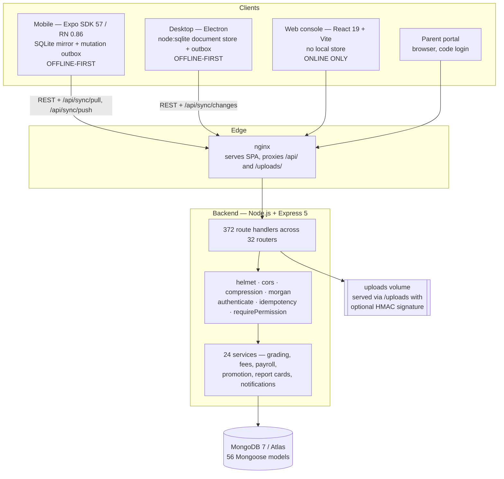
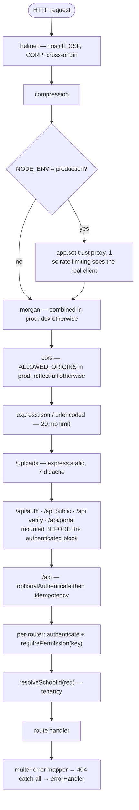
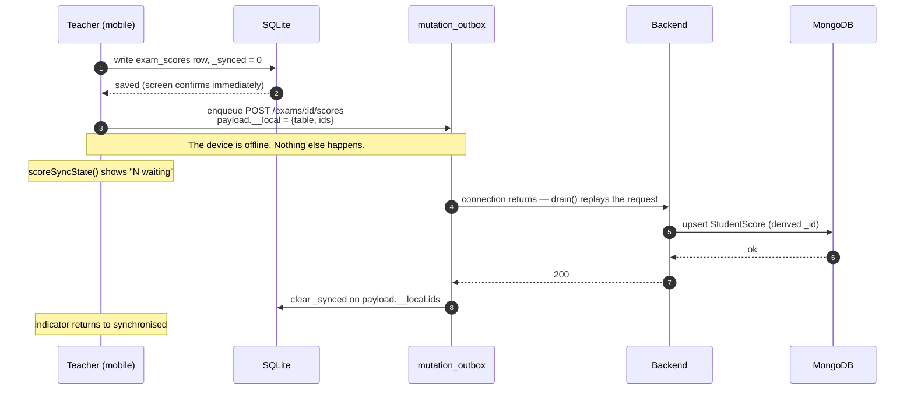
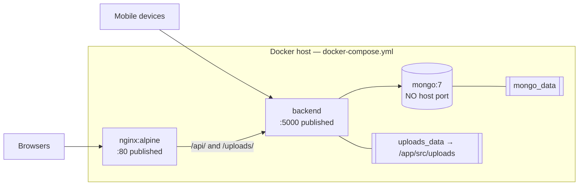
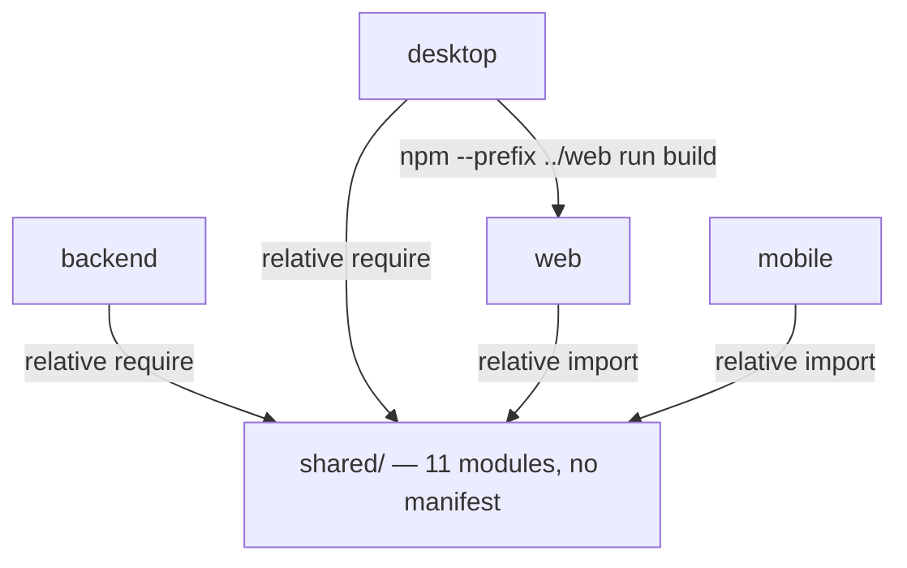

# 02 — Architecture

*Documented commit `be2d2ac`.*

## The system in one paragraph

One MongoDB database and one Express API serve four clients. The **web console**
is a React SPA that talks to the API directly and stores nothing locally. The
**desktop app** is Electron: it serves that same SPA build from disk, and
intercepts its own API calls in the main process, answering them from a local
SQLite document store which synchronizes with the server in the background. The
**mobile app** is Expo/React Native with its own SQLite mirror, a mutation
outbox and an independent, older sync protocol. A **parent portal** is served by
the same API under `/api/portal` and authenticates guardians by code rather than
by account.

The two offline clients do not share sync machinery. They use different
endpoints, different cursor designs, and different local storage engines. This
is the single most important fact about the architecture and is documented in
full in [10-synchronization.md](10-synchronization.md).

---

## System architecture — IMPLEMENTATION VERIFIED

### Why the desktop and mobile paths differ

They were built at different times against different needs, and both are live.

- **Mobile** predates the feed. `/api/sync/pull` returns six collections in one
  response, filtered by a single high-water-mark timestamp. Writes go through a
  per-request **mutation outbox** that replays ordinary REST endpoints.
- **Desktop** uses `/api/sync/changes`, a paginated, capability-gated feed over
  **36 collections**, with a keyset cursor of `(updatedAt, _id)` per collection
  and its own outbox with a dedupe key and an idempotency key.

Neither is deprecated. Replacing the mobile path with the feed is not scheduled.

---

## Request pipeline — IMPLEMENTATION VERIFIED

Order matters here; it is the order in `backend/src/server.js`.

Two ordering decisions carry security weight:

1. **`/api/portal` is mounted above the authenticated `/api` block.** Guardians
   hold no JWT and no `req.user`; mounting below would have subjected them to
   `optionalAuthenticate` and then to guards written for staff.
2. **`idempotency` runs after `optionalAuthenticate`.** The middleware keys on
   `(Idempotency-Key, userId)`, so it is inert for anonymous requests by design —
   a key without an authenticated user is ignored rather than shared.

---

## Data flow — a mark entered offline

If the server *refuses* the write (a 4xx that is not retryable), the outbox row
becomes `failed` and the local rows stay dirty. The marks screen then shows
"N failed" rather than "N waiting" — the distinction exists because a teacher
who sees the same warning every morning stops reading it. See
[07-mobile.md](07-mobile.md).

---

## Deployment architecture — IMPLEMENTATION VERIFIED

Notes that matter operationally:

- **Mongo publishes no host port.** Only the backend reaches it, over the Docker
  network. `MONGO_USER` and `MONGO_PASSWORD` are required with no default —
  compose uses `${VAR:?message}` so the stack refuses to start without them.
- **`uploads_data` mounts at `/app/src/uploads`**, not `/app/uploads`. Mounted at
  the latter the volume stayed empty and uploads did not survive a restart.
- **nginx no longer mounts the uploads volume.** It proxies `/uploads/` to the
  backend so the signature gate is consulted; serving the files directly would
  leave a second, ungated path to them.
- `client_max_body_size 500m` on `/api/` matches the largest multer limit
  (video content, 500 MB).

---

## Package dependency graph

There are **no npm workspaces**. Each of `backend/`, `mobile/`, `desktop/` and
`web/` is an independent package with its own `package.json` and lockfile, and
each must be installed separately. `shared/` is reached by relative path only —
which is why `desktop/scripts/check-request-path.js` asserts that every shared
module the desktop imports still resolves once the app is packaged.

`mobile/.npmrc` sets `legacy-peer-deps=true`; Expo SDK 57 has peer conflicts with
some React 19 packages and installs fail without it.
