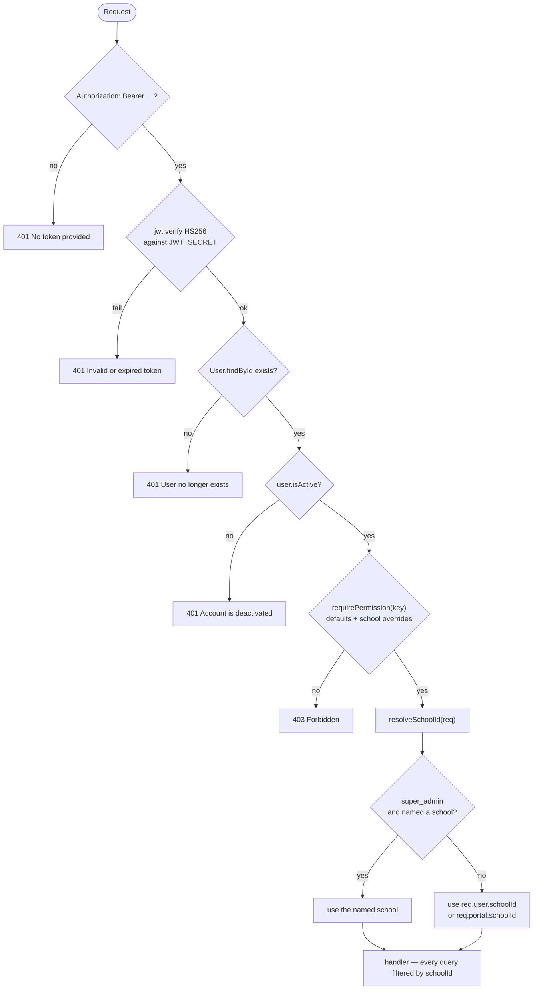

# 06 — Authentication, Authorization and Tenancy

*Documented commit `be2d2ac`.*

Three separate questions, answered by three separate mechanisms:

1. **Who are you?** — `middleware/auth.js`
2. **May you do this?** — `middleware/permissions.js` + `config/permissions.js`
3. **Which school is this about?** — `src/utils/tenant.js`

They are independent. Passing the first two says nothing about the third, which
is why cross-school leaks were possible in routers that skipped step 3.

---

## Authentication — staff and students

### Login — IMPLEMENTATION VERIFIED

`POST /api/auth/login`, rate limited by `loginLimiter`.

| Setting | Value |
|---|---|
| Window | 15 minutes |
| Max attempts | 10 per IP |
| Key | default `express-rate-limit` key generator (IPv6-correct) |
| Opt-out | `DISABLE_LOGIN_RATE_LIMIT` — set only by `scripts/` |

Two login shapes share one endpoint:

- **Staff:** `{ email, password }`
- **Student:** `{ enrollmentNo, password }`

Supplying both, or neither, is rejected. `password` is always required.

Behind a reverse proxy `app.set("trust proxy", 1)` is set **only when
`NODE_ENV=production`**. Without it `req.ip` is the proxy for every request and
the limiter treats the whole school as one client — it would either lock everyone
out together or never trigger.

### Tokens — IMPLEMENTATION VERIFIED, CONFIGURATION DEPENDENT

| Token | Secret | Default lifetime | Override |
|---|---|---|---|
| Access | `JWT_SECRET` (required) | 30 days | `JWT_EXPIRES_IN` |
| Refresh | `JWT_REFRESH_SECRET` (optional) | 90 days | `JWT_REFRESH_EXPIRES` |

Algorithm is pinned: `jwt.sign`/`jwt.verify` both specify **HS256**, so a token
presented with `alg: none` or an asymmetric algorithm is rejected rather than
accepted on the attacker's terms.

**A user who must reset their password gets a deliberately short access token.**
`expiresIn` branches on `user.mustResetPassword` — a first-login window, not a
30-day session.

### `authenticate` — what it actually checks

Per request, in order:

1. `Authorization` header present and starts with `Bearer ` → else 401.
2. Header is well formed → else 401 "Malformed authorization header".
3. `jwt.verify(token, JWT_SECRET, { algorithms: ["HS256"] })` → else 401.
4. `User.findById(decoded.id)` → 401 "User no longer exists" if gone.
5. `user.isActive` → 401 "Account is deactivated".

Steps 4 and 5 mean **deactivating an account takes effect immediately**, without
waiting for the token to expire. The cost is a database read per request.

### Refresh — a deliberate but fragile arrangement

`POST /api/auth/refresh` is registered **twice**, at `auth.routes.js:259` and
`:316`. The first handler calls `next()` when `JWT_REFRESH_SECRET` is unset,
falling through to the second, which refreshes against the access token instead.

This works, and it is intentional — it keeps refresh functioning in deployments
that never configured a refresh secret. It is also exactly the shape that a
route-shadowing bug takes, and a reader who does not know will assume the second
handler is dead. Treat it as load-bearing. **IMPLEMENTATION VERIFIED.**

### Logout

`POST /api/auth/logout` requires no authentication and holds no server-side
session state. **There is no token revocation list** — a stolen access token
stays valid until it expires or the account is deactivated. See
[14-security.md](14-security.md).

### Other auth routes

| Route | Guard |
|---|---|
| `POST /api/auth/change-password` | `authenticate` |
| `GET /api/auth/me` | `authenticate` |

---

## Authentication — guardians (the parent portal)

Guardians are **not** `User` records and hold **no role**. They authenticate
against a `GuardianAccess` row with a code issued on paper.

### Why a code and not an account — IMPLEMENTATION VERIFIED

From `src/services/portal.service.js`: a parent here often has no email address,
shares a phone, and may be replaced by a relative in September. The school issues
a short code and hands it over. **One code covers all of that guardian's
children**, which is why the row is a `GuardianAccess` and not a `Student`.

### Code design

| Property | Value |
|---|---|
| Alphabet | `ABCDEFGHJKLMNPQRTUVWXYZ2346789` — no `O/0`, `I/1`, `S/5` |
| Length | 8, formatted `XXXX-XXXX` |
| Source | `crypto.randomBytes` — a CSPRNG, not `Math.random` |
| Normalisation | uppercased, punctuation stripped, so `abcd efgh` = `ABCD-EFGH` |
| Max tries | 6 |
| Lockout | 15 minutes |
| Session | 12 hours |

The alphabet omissions are not cosmetic: a code is read off paper and typed by
someone who did not choose it, and those three pairs are where that goes wrong.

### The portal is read-mostly

`router.use(portal.portalAuth)` covers every route in `portal.routes.js`. The
portal exposes fees, receipts, results, report cards, attendance, announcements,
notifications and messaging. Message sending is the only write.

**Notification filtering is an allowlist, not a blocklist.** `Notification.body`
can contain a temporary password (admin welcome, password reset), so the portal
selects the notification kinds it will show rather than excluding the ones it
will not. This must stay an allowlist — see [14-security.md](14-security.md).

---

## Authorization

### Roles — IMPLEMENTATION VERIFIED

Five, defined once in `src/config/roles.js`:

`super_admin` · `school_admin` · `bursar` · `teacher` · `student`

`"admin"` was **never** a role in the `User` enum, yet it appeared in guard lists
across the codebase — a string no account could ever match, dead code that read
like a permission. `normalizeRole()` now maps it to `school_admin` and the guards
no longer carry it.

**Why the bursar is not a second admin.** A bursar handles cash daily and is the
one person with a standing reason to touch a pupil's record. Granting them
`school_admin` — which the fee router effectively did, since its guard was the
admin guard — means the person who takes the money can also change the grade of
the child whose parent paid it, promote them, and edit the audit trail
afterwards. `FINANCE_ROLES` keeps the admins in it on purpose: an admin who
cannot see the books cannot approve anything, and approval is the half of
segregation of duties that actually protects the school.

### Permissions

**65 keys** across **30 modules**, defined in `src/config/permissions.js`.

| Property | Count |
|---|---|
| Total keys | 65 |
| Delegable (a school may grant/revoke) | 48 |
| Locked (never delegable) | 17 |
| Roles a school may adjust | 2 — `bursar`, `teacher` |

`requirePermission(key)` and `requireAnyPermission(...keys)` are the middleware.
Effective permissions are `defaults for the role` merged with
`per-school overrides`, cached per school and invalidated on write.

### Permission matrix — defaults, IMPLEMENTATION VERIFIED

Generated directly from `DEFAULTS_BY_ROLE` at this commit. A school may override
only the `bursar` and `teacher` columns, and only for the 48 delegable keys.

| Permission | super_admin | school_admin | bursar | teacher | student |
|---|---|---|---|---|---|
| `fees.view` | YES | YES | YES | — | — |
| `fees.manage` | YES | YES | YES | — | — |
| `expenses.view` | YES | YES | YES | — | — |
| `expenses.manage` | YES | YES | YES | — | — |
| `payroll.view` | YES | YES | YES | — | — |
| `payroll.process` | YES | YES | YES | — | — |
| `payroll.setSalary` | YES | YES | — | — | — |
| `finance.reports` | YES | YES | YES | — | — |
| `fees.refund` | YES | YES | YES | — | — |
| `fees.waive` | YES | YES | YES | — | — |
| `fees.plan` | YES | YES | YES | — | — |
| `fees.remind` | YES | YES | YES | — | — |
| `fees.penalize` | YES | YES | YES | — | — |
| `approvals.view` | YES | YES | YES | — | — |
| `approvals.decide` | YES | YES | — | — | — |
| `approvals.configure` | YES | YES | — | — | — |
| `students.view` | YES | YES | YES | — | — |
| `students.viewTaught` | YES | YES | — | YES | — |
| `students.manage` | YES | YES | — | — | — |
| `students.admit` | YES | YES | — | — | — |
| `students.delete` | YES | YES | — | — | — |
| `students.viewFull` | YES | YES | — | — | — |
| `teachers.view` | YES | YES | — | — | — |
| `teachers.manage` | YES | YES | — | — | — |
| `users.manage` | YES | YES | — | — | — |
| `classes.view` | YES | YES | YES | — | — |
| `classes.manage` | YES | YES | — | — | — |
| `subjects.view` | YES | YES | — | — | — |
| `subjects.manage` | YES | YES | — | — | — |
| `school.view` | YES | YES | YES | — | — |
| `timetable.view` | YES | YES | — | YES | — |
| `timetable.manage` | YES | YES | — | — | — |
| `periods.view` | YES | YES | — | YES | — |
| `periods.manage` | YES | YES | — | — | — |
| `attendance.view` | YES | YES | YES | YES | — |
| `attendance.mark` | YES | YES | — | YES | — |
| `attendance.markStaff` | YES | YES | — | — | — |
| `exams.view` | YES | YES | — | YES | — |
| `exams.manage` | YES | YES | — | — | — |
| `results.view` | YES | YES | YES | YES | — |
| `results.edit` | YES | YES | — | YES | — |
| `results.publish` | YES | YES | — | — | — |
| `reports.viewIssued` | YES | YES | — | YES | — |
| `reports.manage` | YES | YES | — | — | — |
| `promotion.run` | YES | YES | — | — | — |
| `documents.print` | YES | YES | — | YES | — |
| `documents.manage` | YES | YES | — | — | — |
| `exports.roster` | YES | YES | YES | YES | — |
| `exports.finance` | YES | YES | YES | — | — |
| `exports.academic` | YES | YES | — | — | — |
| `gate.scan` | YES | YES | — | YES | — |
| `gate.manage` | YES | YES | — | — | — |
| `announcements.view` | YES | YES | YES | YES | — |
| `announcements.create` | YES | YES | — | YES | — |
| `announcements.manage` | YES | YES | — | — | — |
| `messages.audit` | YES | YES | — | — | — |
| `insights.view` | YES | YES | YES | — | — |
| `homework.view` | YES | YES | — | YES | — |
| `homework.manage` | YES | YES | — | YES | — |
| `quiz.author` | YES | YES | — | YES | — |
| `dashboard.view` | YES | YES | — | — | — |
| `settings.view` | YES | YES | — | — | — |
| `settings.manage` | YES | YES | — | — | — |
| `permissions.manage` | YES | YES | — | — | — |
| `sync.push` | YES | YES | — | — | — |

### Reading the matrix

Three things in it are worth stating explicitly because they surprise people:

1. **`student` holds no permission at all.** Not one of the 65. Student access is
   not expressed through this system — student routes guard themselves with
   `studentOnly` / `scopeToSelfForStudents` and scope every query to the caller's
   own record. The permission table is a *staff* authorization model.

2. **`teacher` does not hold `dashboard.view`.** The admin dashboard is not a
   teacher screen; teachers read `/api/teacher/*` instead.

3. **`sync.push` is granted only to the two admin roles** — and nothing calls the
   endpoint it guards. See the dead-code note below.

### Guard aliases

Most routers alias `requirePermission` locally for readability, so the API
reference shows names like `canRead`, `canManage`, `officeOnly`, `staffRead`.
These are file-local constants; read the top of each router. For example
`fees.routes.js` defines `canRead = requirePermission("fees.view")` and applies
it with `router.use(canRead)` to the whole file.

---

## Multi-school tenancy

### The rule — IMPLEMENTATION VERIFIED

One function, `src/utils/tenant.js`:

```js
resolveSchoolId(req, provided)
```

- A **`super_admin` may name a school** — via `provided`, `req.body.schoolId`,
  `req.query.schoolId` or `req.params.schoolId` — and is taken at their word,
  because operating across schools is what the role is for.
- **Everyone else is their own school**, whatever they asked for. Silently, not
  as an error: clients legitimately send their own `schoolId` on every request,
  and refusing would break all of them. The point is only that the value cannot
  be used to reach further than the caller.
- The caller's own school is `req.user.schoolId` **or** `req.portal.schoolId`, so
  the same function serves guardian requests.

### Writes are different

```js
namedAnotherSchool(req, provided)
```

Reads are corrected silently, which is right. A **write** is not: quietly
redirecting an update to a different school than the URL named would be its own
kind of wrong. Write handlers should call `namedAnotherSchool` and **refuse**.

### Why this is one function and not seventeen

Seventeen routers each carried a private copy of this rule. The three that did
not — `academicStructure`, `termResults`, `annualResults` — took `schoolId` off
the query string and used it as given. With data in two schools, a pupil of one
could read the other's entire term-results table by changing a parameter, and
rewrite the other's academic structure, which is where `passMark` and
`promotionThreshold` live.

A copied rule is a rule that gets missed on the next router. This is the one
copy.

### What tenancy does and does not guarantee

| Guarantee | Status |
|---|---|
| A non-super-admin cannot read another school's data through a `schoolId` parameter | **TEST VERIFIED** — `scripts/check-cross-school.js` |
| Every router that resolves a school uses `resolveSchoolId` | **IMPLEMENTATION VERIFIED** at this commit |
| A super_admin is trusted completely across schools | **By design** — there is no second check on them |
| The database itself enforces tenancy | **NO.** There is one database and one connection. Tenancy is application-level only. A query that omits `schoolId` returns every school's rows. |

That last row is the one to keep in mind when adding a route. Nothing at the
storage layer will catch a missing `schoolId` clause — only the check suites
will, and only for the paths they cover.

---

## Authorization flow



---

## Findings

| Item | Classification |
|---|---|
| `POST /api/sync/push` with `requirePermission("sync.push")` | **UNUSED / DEAD CODE.** The endpoint, its controller (`pushChanges` → `pushPeriodChanges`, `pushStudentDecisions`) and the permission key are all implemented. `/sync/push` is declared in `mobile/src/services/apiEndpoints.js` and `web/src/services/apiEndpoints.ts` but **invoked by nothing**. Mobile writes replay ordinary REST endpoints through the outbox; desktop uses its own outbox. Verified by searching all four clients for the endpoint and for its payload shape (`studentDecisions`, `changes.periods`). |
| Duplicate `POST /api/auth/refresh` | **INTENTIONAL FALLTHROUGH**, described above. |
| No token revocation | **NOT IMPLEMENTED.** Deactivating the account is the revocation mechanism, and it is immediate. |
| `student` role holds zero permissions | **BY DESIGN** — student access is route-guarded and self-scoped, not permission-gated. |
