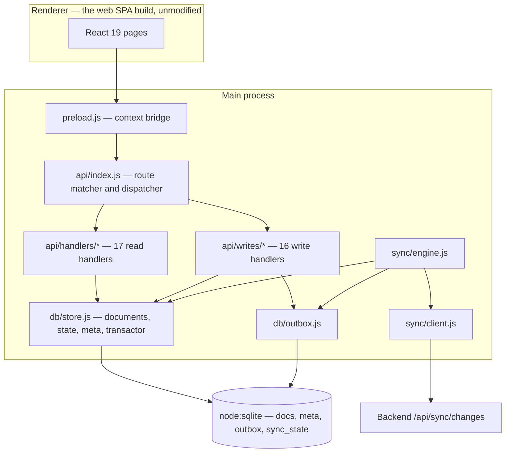

# 08 — Desktop Application

*Documented commit `be2d2ac`. Source: `OfflineSchoolApp/desktop/`.*

Electron. It does **not** contain its own UI: it builds the web app
(`npm --prefix ../web run build`) and serves that bundle, then intercepts the
SPA's own API calls in the main process and answers them from a local document
store. To the renderer it looks like the server is simply there.

---

## Architecture



Entry point is `src/main/main.js` (`package.json` `main`). There are **46 source
files** in `src/main/`.

---

## The local store — IMPLEMENTATION VERIFIED

`src/main/db/store.js`, built on **`node:sqlite`** (`DatabaseSync`) — Node's
built-in SQLite, not `better-sqlite3`.

### Four tables

| Table | Purpose |
|---|---|
| `docs` | The document mirror. `(collection, id)` plus columns lifted out of the JSON because sync and every query filter on them. |
| `sync_state` | Per-collection cursor. |
| `outbox` | Queued writes. |
| `meta` | Schema version and bookkeeping. |

### The API surface

```js
const { open, migrate, documents, state, meta, transactor, SCHEMA_VERSION }
  = require("./db/store");
```

- `documents(db)` — document reads and writes, and **its own** `tx` helper.
- `state(db)` — `cursorFor(collection)`, `setCursor(collection, cursor)`.
- `meta(db)`, `transactor(db)`.

> **Trap for future work:** `transactor(db)` and `documents(db).tx` each maintain
> their **own** transaction-depth counter. Nesting one inside the other raises
> *"cannot start a transaction within a transaction"*. Production code correctly
> uses `docs.tx`; a test harness that reaches for `transactor` around it will
> fail in a way that looks like a store bug and is not.

---

## Migrations and version safety — IMPLEMENTATION VERIFIED

`src/main/db/schema.js` holds an ordered `MIGRATIONS` array;
`SCHEMA_VERSION` is the last entry's version. **Currently 3.**

| Version | Name |
|---|---|
| 1 | documents, sync cursors and the outbox |
| 2 | separate replay identity from double-submit identity |
| 3 | one request may have changed more than one row |

Each migration runs **inside a transaction together with its version bump**, so a
half-applied migration cannot exist. A school's data is not somewhere to discover
that a schema change stopped halfway.

### Refusing a newer database

```js
if (current > SCHEMA_VERSION) {
  // refuse to open — "Update the application rather than downgrading it."
}
```

If the on-disk database was written by a **newer** build than the running binary,
the store refuses to open it. Silently operating against a schema you do not
understand corrupts data; refusing is recoverable. On a refusal — or a migration
failure — the handle is closed, so `migrate` can be retried without ending the
process.

### Migration 2 — worth reading before touching the outbox

`idem_key` was doing two incompatible jobs. It was set to the document id, and
being `UNIQUE` it also served as the guard against a form submitted twice.

Both jobs were done wrongly by one value: a queued **edit** to a document that
already had a queued **create** hit the unique constraint, was reported as a
duplicate and was **discarded** — somebody's change disappeared while the UI
showed it applied. And had it reached the server, the idempotency middleware
scopes stored responses by `(key, userId)` *without the path*, so the edit would
have been answered with the create's response.

The split:

| Column | Identifies | Unique? |
|---|---|---|
| `idem_key` | an **operation** — one queued request | `UNIQUE` |
| `dedupe_key` | an **intent** — e.g. a double-clicked create | indexed, **not** unique |

`dedupe_key` is checked only against entries *still queued*, so repeating the same
intent later is legitimate — a person doing the same thing twice on purpose.

---

## The outbox

```text
outbox(
  seq          INTEGER PRIMARY KEY,   -- ordering
  idem_key     TEXT NOT NULL UNIQUE,
  dedupe_key   TEXT,                  -- migration 2
  attempts     INTEGER NOT NULL DEFAULT 0,
  next_try_at  TEXT,
  last_status  INTEGER,
  last_error   TEXT,
  status       TEXT NOT NULL DEFAULT 'pending'
)
CREATE INDEX idx_outbox_status ON outbox(status, seq);
```

### Ordering

`seq` is a monotonic integer and the drain loop reads in `seq` order. Where mobile
coalesces by `entity_key`, desktop preserves strict submission order.

### Retry policy — IMPLEMENTATION VERIFIED

```js
BACKOFF_SECONDS = [5, 15, 60, 300, 600];
```

`isRetryable(status, code)`:

| Condition | Retryable |
|---|---|
| no status at all (network/DNS) | **yes** — the ordinary offline case |
| `408`, `429` | yes |
| `409` **with** `IDEMPOTENCY_IN_PROGRESS` | yes |
| any `5xx` | yes |
| anything else | **no** → `status = 'blocked'`, `next_try_at = NULL` |

A `blocked` row **stops the queue**: the drain loop breaks on it rather than
skipping past. Later writes may depend on it, so continuing would apply them
against a state that never happened.

> A replay landing on something already stored must **not** reach here as a 409:
> the endpoints that accept client-generated ids answer `200` with `replay: true`.

`Idempotency-Key` is sent with each request so a replay is answered with the
original response rather than creating a second record.

---

## Sync — `/api/sync/changes`

Desktop uses the **feed**, not the mobile pull. 36 collections, capability-gated,
keyset cursor per collection. Protocol detail is in
[10-synchronization.md](10-synchronization.md); what is desktop-specific:

### Each page and its cursor commit together

```js
// The page and its cursor commit in a single transaction. Written the other way
// round, a crash between them loses the page and keeps the cursor.
```

### The cursor stops at the last document actually written

If a document in the page could not be stored, the cursor does **not** move past
it. Otherwise the row is skipped forever with nothing to notice it. The engine
either keeps the previous cursor or synthesises one at the last successfully
written document.

### Refused collections are dropped, not retried

The server answers with the collections this caller's capabilities permit. Any it
refuses are removed from the request list for the rest of the cycle rather than
being asked for again on every page. **TEST VERIFIED** by
`scripts/check-sync-engine.js` — *"a refused collection is reported and then left
alone"*.

### One cycle at a time

An in-flight cycle is not a refusal; a second trigger is ignored rather than
starting a concurrent pass over the same cursors.

---

## Packaging

| Script | Command |
|---|---|
| `npm start` | `node scripts/launch.js` |
| `npm run build:web` | `npm --prefix ../web run build` |
| `npm run package` | `build:web` then `electron-builder --config electron-builder.yml` |
| `npm run package:dir` | as above with `--dir` (unpacked, for testing) |

`desktop/dist/` holds build output. Because the renderer is the web build,
**a desktop release requires a working `web` build** — the two packages are
coupled at package time even though they are independent npm projects.

`scripts/check-request-path.js` asserts that every `shared/` module the desktop
imports still resolves *once the application is installed*, which relative paths
from a packaged asar do not do for free.

---

## Verification — TEST VERIFIED

```bash
cd OfflineSchoolApp/desktop
npm run check
```

Nine suites, **216 assertions**, all green at this commit:

| Suite | Script | Assertions |
|---|---|---|
| `check:routes` | route shadowing | 6 |
| `check:store` | document store | 51 |
| `check:outbox` | outbox | 57 |
| `check:crash` | crash seams | 9 |
| `check:sync` | sync engine | 48 |
| `check:path` | request-path resolution | 45 |
| `check:student-writes` | student writes against the real store | reports `REAL STORE: ALL PASS` |
| `check:results` | results | reports `ALL PASS` |
| `check:settings` | settings | reports `ALL PASS` |

The last three print a pass/fail verdict rather than a count, which is why the
assertion total (216) covers six suites and not nine.

CI runs this job with `ELECTRON_SKIP_BINARY_DOWNLOAD=1` — nothing in
`npm run check` touches Electron itself, so skipping the ~100 MB binary removes
the flakiest step in the install.

---

## Desktop versus mobile

| | Mobile | Desktop |
|---|---|---|
| Storage | `expo-sqlite`, ~40 relational tables | `node:sqlite`, 4 tables, documents as JSON |
| Sync endpoint | `GET /api/sync/pull` | `GET /api/sync/changes` |
| Collections | 6 | 36 |
| Cursor | one high-water timestamp for everything | `(updatedAt, _id)` keyset, per collection |
| Outbox ordering | `created_at`, coalesced by `entity_key` | strict `seq` |
| Replay identity | `Idempotency-Key` + derived `_id` | `idem_key` (operation) + `dedupe_key` (intent) |
| Blocked write | `failed` after 8 retries; queue continues | `blocked`; queue **stops** |
| Schema versioning | per-table `PRAGMA` probes, no global version | global `SCHEMA_VERSION`, refuses a newer DB |

Neither is deprecated, and there is no scheduled convergence.
