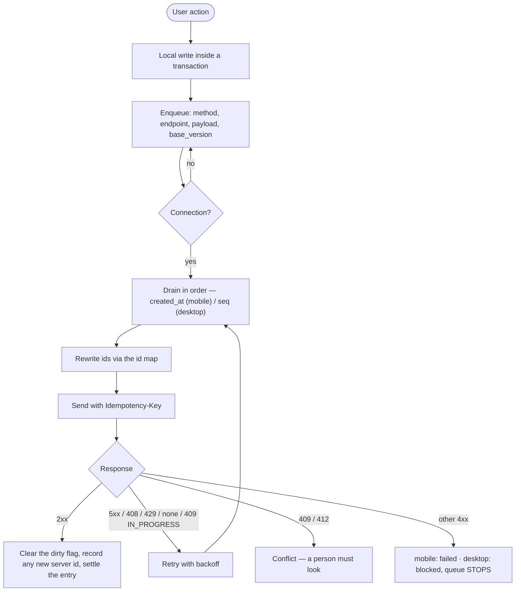

# 10 — Synchronization

*Documented commit `be2d2ac`.*

**There are two independent sync protocols.** They do not share code, cursors,
storage or design. Both are live and supported. Confusing them is the most likely
source of a wrong change in this system, so this document treats them separately
throughout.

| | Mobile | Desktop |
|---|---|---|
| Pull endpoint | `GET /api/sync/pull` | `GET /api/sync/changes` |
| Controller | `src/controllers/sync.controller.js` | `src/controllers/syncFeed.controller.js` |
| Collections | **6** | **36** |
| Cursor | one timestamp for everything | `(updatedAt, _id)` per collection |
| Pagination | none — one response | `limit`, default 500, max 2 000 |
| Capability gating | none beyond `authenticate` | per collection, per permission |
| Push | ordinary REST endpoints via the outbox | ordinary REST endpoints via the outbox |

`POST /api/sync/push` exists, is permission-gated on `sync.push`, and is
**called by no client**. See [06](06-authentication-authorization.md).

---

## Mobile — `GET /api/sync/pull`

### Request

```http
GET /api/sync/pull?lastSync=2026-09-01T12:00:00.000Z
Authorization: Bearer <JWT>
```

### Response — IMPLEMENTATION VERIFIED

```json
{
  "success": true,
  "data": {
    "classes":      [],
    "teachers":     [],
    "subjects":     [],
    "periods":      [],
    "assignments":  [],
    "students":     [],
    "deletedItems": []
  },
  "timestamp": "2026-09-01T12:05:00.000Z"
}
```

Six collections. `teachers` is `User` filtered to `role: "teacher"`; `students`
is filtered to `status: "approved", isActive: true`. Every collection except
`teachers` also filters `deletedAt: null`.

**`deletedItems` is always an empty array.** Deletions are not propagated by this
endpoint. `PARTIALLY IMPLEMENTED` — the field is a placeholder, and a record
soft-deleted on the server simply stops being sent, leaving the device's copy in
place until something else overwrites it.

### The cursor, and the one-millisecond hole that was closed

`timestamp` is stamped **before** the queries run, so a row written while they are
in flight is re-sent next time rather than skipped. That reasoning is correct and
it still had a hole, because the filter used to be exclusive:

> Take a cursor stamped at `T`. The queries begin in that same millisecond. A row
> written at exactly `T`, after its collection's query has already run, is not in
> the reply — and the next pull asks for `updatedAt > T`, which excludes it. That
> row is never offered to that device again. Not a delay: a permanent hole, one
> millisecond wide, in whichever collection somebody happened to be writing to.

The filter is therefore **`$gte`**, not `$gt`. The cost is that rows stamped
exactly on the cursor come back once more, which the client already tolerates —
every pull applies as an upsert. **Re-sending is the safe direction; skipping is
not.**

A `lastSync` in the **future** is clamped to the epoch with a warning, so a
device with a bad clock re-syncs everything rather than silently receiving
nothing.

**TEST VERIFIED** by `backend/scripts/check-sync-cursor.js`.

---

## Desktop — `GET /api/sync/changes`

### Request

```http
GET /api/sync/changes?collections=student,feeCharge&cursors=<json>&limit=500
Authorization: Bearer <JWT>
```

| Parameter | Default | Max |
|---|---|---|
| `limit` | 500 | 2 000 |
| `collections` | all the caller may see | — |
| `cursors` | per collection, from the previous page | — |

### The cursor is a pair, and this is the whole point

The obvious design is *"give me everything with `updatedAt > T`"*. It is broken,
and it breaks in a way testing rarely catches: **`updatedAt` is not unique.**

Two documents written in the same millisecond, split across a page boundary, mean
the second is never returned — `updatedAt > T` excludes it along with the first.

So the cursor is the pair `(updatedAt, _id)` and the filter is:

```text
updatedAt > t  OR  (updatedAt = t AND _id > id)
```

with a matching sort. `_id` is unique, so the pair is a **total order** and every
document is offered exactly once. Being a total order, it can be exclusive with no
boundary tolerance at all — which is why the desktop feed does not need the
mobile feed's `$gte`.

The cursor is encoded as `{ at: ISO string, id: string }`. `parseCursor` requires
**both halves or neither** — a cursor carrying only a timestamp is the broken
design, and accepting one would silently reintroduce it.

### A limit the feed does not guard — documented, not fixed

A high-water mark is only as good as `updatedAt`. If a document's `updatedAt` is
**ahead of the clock** — a data import that preserved original timestamps, or a
row written with a deliberate future date — the cursor moves past it, and every
row written afterwards sorts *before* the cursor and is never offered again.

This is **not guarded**, on purpose: the obvious guard (clamping the cursor to
`now`) is worse, because it would re-send the entire tail on every cycle. The
mitigation is operational — the desktop clears its cursor before the sections
that need a full pass. See [18-operations-troubleshooting.md](18-operations-troubleshooting.md).

### Capability gating — IMPLEMENTATION VERIFIED

Each of the 36 fed collections declares the permission that gates it:

| Collection group | Permission |
|---|---|
| `school` | `school.view` |
| `class`, `subject`, `period`, `teacherAssignment` | `classes.view` / `subjects.view` / `periods.view` |
| `student`, `enrollment` | `students.view` **or** `students.viewTaught` |
| `user` | `users.manage` — and `omit: ["password", "tempPassword"]` |
| `feeStructure`, `feeCharge`, `feePayment`, `paymentPlan` | `fees.view` |
| `expense`, `expenseCategory` | `expenses.view` |
| `payrollRun`, `salaryPayment` | `payroll.view` |
| `salaryStructure` | `payroll.setSalary` |
| `studentAttendance`, `teacherAttendance` | `attendance.view` |
| `exam`, `examSubject`, `academicStructure` | `exams.view` |
| `studentScore`, `resultSummary`, `termResult`, `annualResult`, `grade`, `gradingConfig` | `results.view` |
| `homework` | `homework.view` |
| `reportTemplate` | `reports.manage` |
| `promotionRun`, `promotionDecision` | `promotion.run` |
| `studentApplication` | `students.admit` |
| `announcement` | `announcements.view` |
| `timetableSlot` | `timetable.view` |

A collection the caller may not have is **refused**, and the desktop engine drops
it from the request list for the rest of the cycle.

### Exclusions are explicit, and enforced

`assertEveryModelIsClassified()` fails the build if a model is in neither `FEED`
nor `EXCLUDED`, and `EXCLUDED` entries must carry a non-empty reason. Adding a
model without deciding whether devices may mirror it is a hard error — this is
how `AttendanceChangeLog` was caught at `be2d2ac`.

The 16 exclusions and why:

| Model | Why not mirrored |
|---|---|
| `Notification` | the rendered body **contains temporary passwords** for admin welcome and password reset |
| `IdempotencyKey` | server-side replay protection |
| `Counter` | atomic sequences — two offline machines cannot share one |
| `SyncLog` | operational, not school data |
| `SyncOverwrite` | an instruction *to* a specific device, consumed by the mobile engine |
| `Conversation`, `Message` | private correspondence; `messages.audit` is an audit capability, not a licence to mirror |
| `GuardianAccess` | a stale mirror of who may see which pupil is the wrong thing to be stale |
| `GateEvent` | written by the gate device and read live |
| `DocumentVerification` | reached by its own unauthenticated route |
| `GeneratedReport`, `Content` | files, not documents — they belong in a file cache |
| `QuizModule` | quiz definitions **including the answers** |
| `ResultChangeLog`, `AttendanceChangeLog` | audit trails, read on demand from an office |
| `Attendance` | not a model name — the file registers `StudentAttendance` and `TeacherAttendance` |

### Two acknowledged feed gaps — `KNOWN_GAPS`

Declared in code rather than left to be discovered:

1. **teacher** cannot receive `class`, `subject` or `teacherAssignment` — no
   capability grants a teacher any of them. Their screens read through
   `/api/teacher` and `/sync/pull` instead.
2. **bursar** cannot receive `user`. A bursar holds `payroll.view` but not
   `users.manage`, so payslips would mirror without the staff names the payroll
   screen joins on. The desktop declines that one view rather than showing a
   payroll with every name blank. Closing it properly needs the feed to be able to
   say *"names, not the account directory"*, which it cannot yet. **PLANNED.**

---

## Write path — both clients

Neither client has a bespoke push protocol. **Writes replay ordinary REST
endpoints** from a durable local queue.



### Idempotency at three layers

1. **Derived `_id`** — attendance rows and exam scores compute their `_id` from
   the natural key, so a replay upserts the same document instead of inserting a
   second. This is why a replayed register write is harmless without any header.
2. **`Idempotency-Key`** — `(key, userId)` scoped. A completed request replays its
   stored response; an in-flight one answers `409 IDEMPOTENCY_IN_PROGRESS` with
   `Retry-After: 2`; a 5xx **deletes** the key so a genuine retry is possible.
3. **Client-supplied `_id`** — endpoints that accept a client-generated id answer
   `200` with `replay: true` rather than `409`, so a replay never looks like a
   conflict to the outbox.

---

## Crash safety

### Where the seams are

| Seam | Risk | Protection |
|---|---|---|
| local write ↔ enqueue | a write with no queue entry — an **orphan** | mobile: both inside one transaction; orphans are additionally *counted and surfaced* by `syncState.js` |
| send ↔ settle | the server applied it, the device crashed before recording that | `Idempotency-Key` + derived `_id` make the replay a no-op |
| page ↔ cursor | the page is lost but the cursor advanced — a permanent hole | desktop commits **page and cursor in one transaction**; the cursor never passes a document that failed to store |
| migration ↔ version bump | a half-applied schema | desktop runs each migration **and** its version bump inside one transaction |

**TEST VERIFIED** by `desktop/scripts/check-crash-seams.js` (9 assertions) and
`check-outbox.js` (57).

### The orphan class, stated plainly

A dirty local row with no outbox entry behind it is retried by nothing and, until
`be2d2ac`, counted by nothing. One source was fixed — a refused save left its
local write behind — but the class is not proven impossible. `classifyDirtyRows`
now reports orphans **with the failures**, which is the safer of the two ways to
be wrong about them. See [07-mobile.md](07-mobile.md).

---

## Sync performance — MEASURED

From `backend/scripts/check-query-plans.js` at ~2 000 pupils across two schools:

| Query | Plan | Returned | Examined | Latency |
|---|---|---|---|---|
| one page of the change feed | `IXSCAN` | 500 | 1 500 docs / 1 500 keys | 78 ms |
| the same, repeated | — | — | — | median **38 ms**, worst **50 ms** (budget 250) |

The feed examines **3× the documents it returns** at this size. It is index-served
and well inside budget, but the ratio is the thing to watch as data grows — see
[15-performance.md](15-performance.md).

---

## Findings

| Item | Classification |
|---|---|
| `data.deletedItems` in `/sync/pull` | **PARTIALLY IMPLEMENTED** — always `[]`. Deletions are not propagated to mobile. |
| `POST /api/sync/push` | **UNUSED / DEAD CODE** — implemented server-side, called by nothing. |
| Future-`updatedAt` documents can be skipped by the desktop cursor | **KNOWN, UNGUARDED, DELIBERATE.** Mitigated operationally by clearing the cursor. |
| Two protocols with no convergence plan | **BY DESIGN at this commit.** Neither is deprecated. |
| Real two-device convergence | **REQUIRES REAL-WORLD VALIDATION** — every multi-device claim here rests on simulated clients. |
