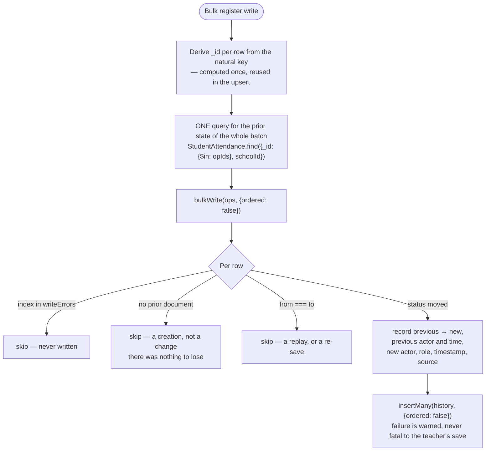
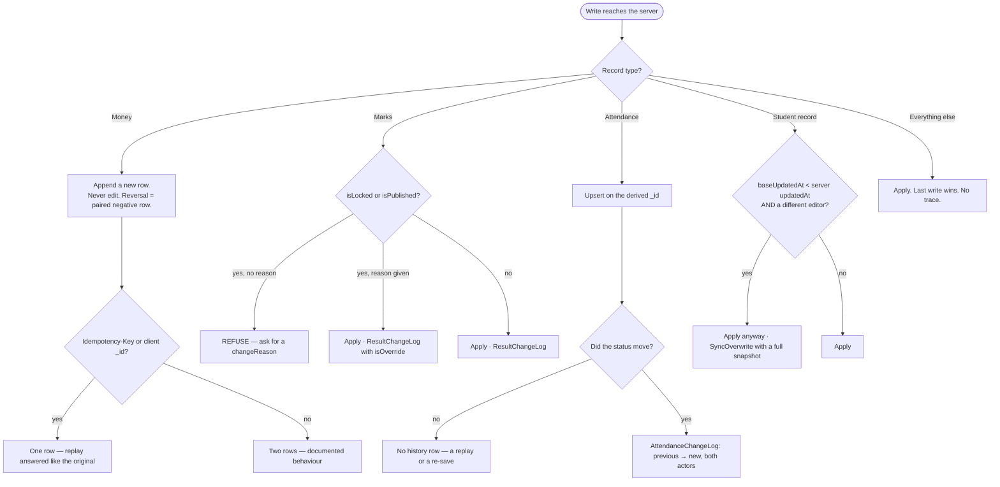

# 11 — Conflict Resolution

*Documented commit `be2d2ac`.*

## The actual strategy

**Last-write-wins, with an audit trail wherever the losing write mattered.**

Not optimistic locking, not CRDTs, not merge dialogs. That is a deliberate trade
for a school: two people editing the same record in the same minute is rare, and
a merge dialog on a phone in a corridor is worse than the problem it solves.

The condition attached to that trade is the important part:

> Last-write-wins is only acceptable while the losing write leaves a trace.

Attendance was the one record type where it left none. That gap was closed at
this commit. Money never used last-write-wins at all.

---

## Strategy by record type

| Record type | Conflict strategy | Audit history | Recoverable |
|---|---|---|---|
| **Exam marks** (`StudentScore`) | Last-write-wins on a derived `_id` | `ResultChangeLog` — old and new value, actor, reason | **Yes** |
| **Result summaries** | Last-write-wins; refused while locked without a reason | `ResultChangeLog` incl. `locked`/`unlocked` | **Yes** |
| **Student attendance** | Last-write-wins on a derived `_id` | `AttendanceChangeLog` | **Yes** (since `be2d2ac`) |
| **Teacher attendance** | Last-write-wins on a derived `_id` | **none** | **No** — `PARTIALLY IMPLEMENTED` |
| **Student records** | Last-write-wins, with `baseUpdatedAt` detection | `SyncOverwrite` incl. a full snapshot of the losing version | **Yes** |
| **Fee payments** | **Append-only.** Never edited. | The ledger itself; reversals are paired rows | **Yes** |
| **Salary payments** | Append-only, unique per `(school, user, month, run)` | payslip records | **Yes** |
| **Expenses** | Append-only | the ledger | **Yes** |
| **Classes, subjects, timetable** | Last-write-wins | none | **No** |
| **Announcements, homework** | Last-write-wins | none | **No** |

---

## Exam marks

### The mechanism

`StudentScore._id` is derived from `(examId, studentId, subjectId)`, which is also
its unique index. A re-mark therefore **updates in place**, and a replayed sync
upserts the same document rather than inserting a second.

### The audit trail

`ResultChangeLog` records `field`, `oldValue`, `newValue`, the actor and their
role, a `batchId` grouping bulk edits, and `isOverride` for edits made against a
lock.

### Published and locked results

Two separate states on `ResultSummary`:

| Flag | Meaning |
|---|---|
| `isPublished` / `publishedAt` | families can see it |
| `isLocked` / `lockedAt` | it may not be edited without an explicit reason |

Editing a **published** result requires a `changeReason` in the request body. The
server refuses without one and answers with a message asking for it:

```json
{ "success": false,
  "message": "Send a `reason` explaining why these results are being unlocked." }
```

Both clients now provide a place to type it — a prompt on the web console's save
path and on the mobile equivalent. Before that the server's requirement was a
dead end: the API refused and no UI could satisfy it.

`reason` and `changeReason` are both accepted on the unlock route.

**Historical note, still relevant:** nothing checked `isLocked` or `isPublished`
on one edit path, so a published report card could change under a family without
a record. That check is present now; results published *before* it was added were
never re-processed. See [19-known-limitations.md](19-known-limitations.md).

---

## Attendance

### Why the gap existed

Attendance is last-write-wins over a **unique natural key**, so a re-mark
`UPDATE`s the row. `markedBy` names whoever set the value that survived; nothing
recorded what it replaced.

> A pupil marked present by the form master and absent by a subject teacher an
> hour later ended the day absent, with no way for anyone to learn there had been
> a disagreement at all — which is exactly the question a parent asks.

Under sync it was worse: a phone whose outbox drained an hour late silently
overwrote a correction made on the web, and looked identical to a deliberate
change.

### The fix

`AttendanceChangeLog`, written by the **student** bulk path only, records the
crossing:



### Why there is no de-duplication key

A row is written **only when the status actually moved**, and that is what makes a
replayed sync safe without a key:

- first attempt: reads `present`, writes `absent`, records `present → absent`;
- the replay: reads `absent`, finds new equal to old, **writes nothing**.

Nothing to collide, nothing to reconcile. A deliberate change back —
`absent → present → absent` — is three genuine rows, and any dedup key clever
enough to suppress the retry would suppress that too. Leaving it out is the safer
of the two mistakes.

### Reading it back

```http
GET /api/attendance/history?studentId=…&from=2026-09-01&to=2026-09-30&limit=100
```

Guarded by `staffRead` and scoped with `resolveSchoolId(req)`. Filters:
`studentId`, `attendanceId`, `date`, or `from`/`to`. An exact `date` wins over a
range. `limit` is capped at 500. Actor names are resolved through a `User`
lookup, falling back to the denormalised `changedByName`.

**TEST VERIFIED** — `backend/scripts/check-attendance-history.js`, 21 assertions.
Against the previous commit 7 of them fail.

### The gap that remains

`POST /api/attendance/teachers/bulk` is a near-copy of the student route and
**does not write the log**. Staff register overwrites still leave no trace.
`PARTIALLY IMPLEMENTED`.

---

## Student records

The only place using a client-supplied baseline.

A client sends `baseUpdatedAt` — the `updatedAt` it last saw. On the server,
`logOverwriteIfNeeded()`:

1. no `baseUpdatedAt`, or an unparseable one → do nothing;
2. `student.updatedAt <= baseline` → nobody else changed it, do nothing;
3. the previous editor **is the same person** → do nothing (you may overwrite
   yourself);
4. otherwise → write a `SyncOverwrite` carrying a **full snapshot** of the
   version being replaced.

**The write still proceeds.** This is detection and audit, not a rejection —
last-write-wins is preserved.

`SyncOverwrite` carries who won, who lost, the action (`suspend`, `move`,
`delete`), `lostVersion` (the snapshot), and `seenByLoser` / `seenAt` /
`dismissedAt` so the loser can be shown what happened. The mobile app has screens
for this at `app/admin/sync-overwrites/`.

**`SyncOverwrite` is excluded from the device feed** because it is an instruction
*to* one specific device, consumed by the mobile sync engine — not shared data.

---

## Financial records — a different model entirely

Money never uses last-write-wins, because a corrected ledger is not a ledger.

### Payments are append-only

`FeePayment` rows are not edited. A correction is a **new, paired row**:

| Field | Purpose |
|---|---|
| `amount` | **positive on a payment, negative on a reversal** |
| `reversesId` | on the reversal → the original |
| `reversedById` | on the original → the reversal, so the UI can grey it out |
| `reversalReason` | why |
| `isReversal` / `isReversed` | virtuals derived from the two ids |

Storing the **sign** rather than a `type` field means the balance is a plain sum
and cannot disagree with itself.

`amount` is validated as an **integer** — *"Amounts are whole XAF; the currency
has no minor unit."*

### Duplicate prevention is at the request layer

There is deliberately **no unique index on a payment's natural key** — a family
may genuinely pay the same amount twice on the same day. Instead:

| Client sends | Result |
|---|---|
| `Idempotency-Key` | one payment; the replay is answered like the original |
| a client-generated `_id` | one payment; a corrected amount under a new id is its own payment |
| **neither** | **two payments** — by design |

The last row is tested explicitly: *"a retry with no id of any kind records both,
as designed — the client must supply one."* `check-duplicate-money.js` also
asserts that **every client that writes money supplies an id**, so the burden
cannot quietly fall off a screen.

**TEST VERIFIED** — `backend/scripts/check-duplicate-money.js`.

---

## Conflict resolution flow



---

## Multi-device convergence

| Claim | Status |
|---|---|
| Replayed writes converge (derived `_id`, idempotency keys) | **TEST VERIFIED** — `check-idempotency.js`, `check-duplicate-money.js`, `desktop/check-outbox.js` |
| The losing write is recoverable for marks, attendance and student records | **TEST VERIFIED** |
| Two real devices converge against each other in the field | **REQUIRES REAL-WORLD VALIDATION** — every multi-device result here comes from simulated clients against an in-memory MongoDB |

---

## Findings

| Item | Classification |
|---|---|
| Teacher attendance has no change log | **PARTIALLY IMPLEMENTED** — the student path writes one, the near-identical staff path does not. |
| Classes, subjects, timetable, announcements, homework | **NO AUDIT TRAIL.** Last-write-wins with no trace. Acceptable for configuration; worth knowing before treating any of them as a record of fact. |
| Results published before the lock check existed | **NOT REMEDIATED** — a data task, not a code one. See [19](19-known-limitations.md). |
