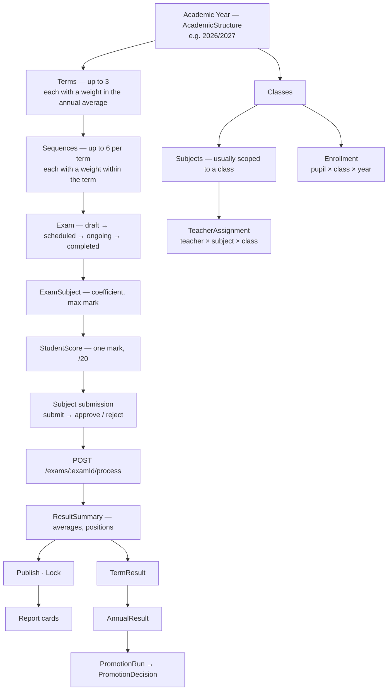

# 12 — Academic Workflows

*Documented commit `be2d2ac`.*

## The academic lifecycle



---

## Academic structure — IMPLEMENTATION VERIFIED

One `AcademicStructure` per `(schoolId, academicYear)`. It is the configuration
everything else reads.

| Field | Type | Default | Meaning |
|---|---|---|---|
| `academicYear` | String | — | `"2026/2027"` |
| `terms[]` | up to 3 | — | `{number (1–3), name, weight, sequences[]}` |
| `terms[].weight` | Number | `33.33` | share of the annual average |
| `terms[].sequences[]` | up to 6 | — | `{number (1–6), name, weight, assessment}` |
| `sequences[].weight` | Number | `50` | share within the term (equal = 50/50) |
| `sequences[].assessment` | subdoc | — | `{type, label}` e.g. `"Test 1"`, `"Mid-Term"` |
| `annualAverageMethod` | enum | `"terms"` | `"terms"` or `"sequences"` |
| `promotionExams[]` | Number[] | `[]` | which sequence numbers count for promotion |
| `promotionThreshold` | Number | `10` | minimum /20 average to be promoted |
| `passMark` | Number | `10` | pass mark, /20 |
| `maxAbsences` | Number \| null | `null` | `null` = no limit |

`annualAverageMethod` is the switch that changes the arithmetic: `"terms"`
averages the three term results by their weights; `"sequences"` averages the
sequence marks directly. Both are implemented
(`annualGrading.service.js`).

**Routes:** `GET /api/academic-structure/:schoolId/:year`,
`PUT /api/academic-structure/:schoolId/:year`,
`GET /api/academic-structure/:schoolId`.

> These three routes take `:schoolId` from the URL. They are among the routers
> that previously used it as given; they now resolve through `resolveSchoolId`.
> **TEST VERIFIED** by `check-cross-school.js`.

---

## Grading — one scale, one copy

`shared/gradeScale.js` is the single source. It is read by:

- `backend/src/services/grading.service.js` — grades every mark entered
- `backend/src/db/models/GradingConfig.js` — `findGradeBand`'s fallback
- `backend/src/routes/admin.routes.js` — `GET`/`PUT /settings/grading`
- `desktop/src/main/api/gradeUtils.js` — the same grading, offline
- `desktop/src/main/api/handlers/settings.js` — the same read, offline

### Why it is shared

There were four copies and they disagreed. Three carried a seven-band scale with
no `C+` and their own remarks — *"Fairly Good"*, *"Poor"*, *"Very Poor"* — and
those three were the ones that actually graded marks. A pupil on 11.5 was told
*"C / Average"* by the report card while the school's own table said
*"C+ / Above Average"*. Correcting the settings screen did not touch it, because
the settings screen was not what did the grading.

### Band boundaries

`minMark` inclusive, `maxMark` the top of the band, ordered highest first. **A
mark landing exactly on a boundary belongs to the higher band** — 18 is A+, 16 is
A — which is what *"18 to 20"* and *"16 to 18"* mean, and what first-match-wins
over that order produces.

### Bilingual remarks

Each band carries **both** an English and a French remark, and the renderer picks
by language. Before this, only the report card's *labels* were translated —
"Observation" over a column still containing "Above Average". The remark is the
part a parent actually reads. A school that rewrites its remarks writes both.

Per-school overrides live in `GradingConfig`; the shared scale is the fallback.

---

## Exams and marks

### Exam lifecycle

`Exam.status`: `draft` → `scheduled` → `ongoing` → `completed`, set via
`PATCH /api/exams/:id/status`.

### Entering marks

| Route | Purpose |
|---|---|
| `GET /api/exams/:examId/subjects` | subjects in this exam, with coefficients |
| `GET /api/exams/:examId/scores` | the mark sheet |
| `POST /api/exams/:examId/scores/bulk` | save a class's marks in one request |

Marks are `/20`. `StudentScore._id` is derived from `(examId, studentId,
subjectId)` so a re-save updates in place and a replay is a no-op.

Offline, the mobile app writes to `exam_scores` with `_synced = 0` and queues the
bulk request. See [07-mobile.md](07-mobile.md) for how the pending / failed /
orphaned state is surfaced.

### Submission and approval — IMPLEMENTED

Per exam-subject, not per exam:

```text
PATCH /api/exams/:examId/subjects/:examSubjectId/submit
PATCH /api/exams/:examId/subjects/:examSubjectId/approve
PATCH /api/exams/:examId/subjects/:examSubjectId/reject
```

A teacher submits their subject's marks; an admin approves or rejects. Progress is
readable through `GET /api/exams/:examId/submissions`.

### Processing

```text
POST /api/exams/:examId/process
```

Computes `ResultSummary` per pupil: subject averages weighted by coefficient, the
overall average, and three positions — `classPosition`, `schoolPosition`,
`gradePosition`, each with its own index.

Coefficients come from `ExamSubject` via `subjectCoefficient.service.js`.

---

## Publishing and locking

Two independent flags on `ResultSummary`.

| Action | Route | Effect |
|---|---|---|
| Publish | `POST /api/exams/:examId/…` (`ctrl.publishResult`) | `isPublished: true`, `publishedAt` — families can see it |
| Lock | `PATCH /api/exams/:examId/lock` | `isLocked: true`, `lockedAt` |
| Unlock | `PATCH /api/exams/:examId/unlock` | **requires a reason** |

Unlocking without a reason is refused:

```json
{ "success": false,
  "message": "Send a `reason` explaining why these results are being unlocked." }
```

Both `reason` and `changeReason` are accepted. Every lock and unlock is written to
`ResultChangeLog` with `action: "locked"` / `"unlocked"`.

Editing a **published** result likewise requires a `changeReason`, recorded on the
log entry with `isOverride: true`. Both the web console and the mobile app now
prompt for it; before that the server's requirement had no UI that could satisfy
it.

### Staleness

`resultStaleness.service.js` detects published results whose **inputs** have since
moved — a mark corrected after publication. This flags them; it does not
re-publish them.

---

## Term and annual results

Symmetrical route sets:

| | Term | Annual |
|---|---|---|
| List | `GET /api/term-results` | `GET /api/annual-results` |
| One pupil | `GET /api/term-results/student/:studentId` | `GET /api/annual-results/student/:studentId` |
| Compute | `POST /api/term-results/compute` | `POST /api/annual-results/compute` |
| Publish | `POST /api/term-results/publish` | `POST /api/annual-results/publish` |
| Report card | `GET /api/term-results/:studentId/report-card` | `GET /api/annual-results/:studentId/report-card` |

Unique per `(schoolId, academicYear, term, classId, studentId)` and
`(schoolId, academicYear, classId, studentId)` respectively — recomputing
replaces rather than duplicating.

Both carry `isPublished`, and both are computed by services that read
`AcademicStructure` for weights and `annualAverageMethod`.

**TEST VERIFIED** — `check-term-compute.js`, `check-coefficients.js`,
`check-term-annual-cards.js`, `check-result-classnames.js`.

---

## Report cards

| Layer | Where |
|---|---|
| Data assembly | `backend/src/services/reportCardData.service.js` |
| HTML rendering | `backend/src/services/reportHtml.service.js` |
| Template model | `ReportTemplate`, editable in the app |
| Token vocabulary | `shared/reportTokens.js` |
| Layout helpers | `shared/reportCard.js` |
| Official header | `shared/officialHeader.js` |
| Rendered artefacts | `GeneratedReport` |

Templates are token-based; `shared/reportTokens.js` defines the vocabulary so the
builder and the renderer cannot disagree about what a token means.

Web routes: `/reports`, `/reports/cards`, `/reports/templates`,
`/reports/builder`, `/reports/preview`.

**Grouping rule:** any page listing subjects or students groups them **by class**.
This applies to exam subject listings, mark sheets, result pages and report-card
selection.

**TEST VERIFIED** — `check-report-card.js`, `check-template-repair.js`,
`check-student-classnames.js`.

---

## Promotion

```text
GET    /api/promotion/progression              read the progression map
PUT    /api/promotion/progression              set it
POST   /api/promotion/runs                     start a run (produces decisions)
GET    /api/promotion/runs
GET    /api/promotion/runs/:runId
PATCH  /api/promotion/runs/:runId/decisions/:studentId   override one pupil
POST   /api/promotion/runs/:runId/commit       apply it
POST   /api/promotion/runs/:runId/reverse      undo it
DELETE /api/promotion/runs/:runId              discard an uncommitted run
GET    /api/promotion/students/:studentId/history
```

A run is a **proposal**. It computes a `PromotionDecision` per pupil against
`promotionThreshold` (and `promotionExams`, and `maxAbsences` where set), an admin
reviews and may override individual decisions, and only `commit` changes anything.
`reverse` exists because an end-of-year mistake applied to a whole school is not
something to fix by hand.

`promotion.run` is granted to `super_admin` and `school_admin` only.

---

## Findings

| Item | Classification |
|---|---|
| `annualAverageMethod: "sequences"` | **IMPLEMENTED** but far less exercised than `"terms"`; no suite covers it end-to-end. |
| `maxAbsences` | **IMPLEMENTED** as a field; its effect on promotion decisions is not covered by a check suite. |
| Results published before the lock check existed | **NOT REMEDIATED.** A data task. See [19](19-known-limitations.md). |
| Exam routes `/reports/results`, `/submissions/results`, `/submissions/submissions` | Odd doubled paths that resolve; likely historical aliases. Not dead — they register handlers — but worth auditing before treating them as API. |
