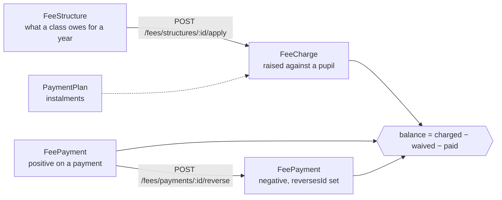
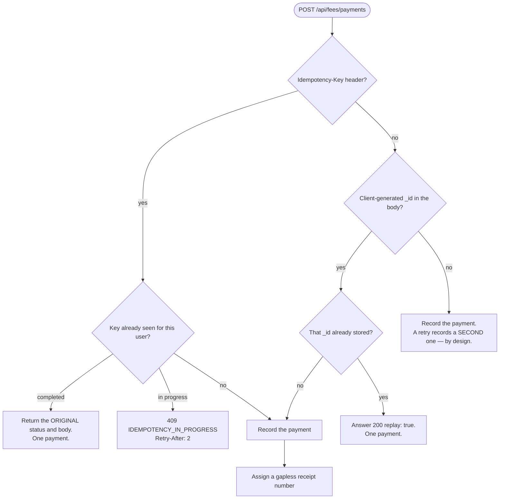
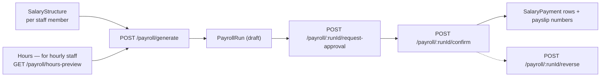

# 13 — Financial Workflows

*Documented commit `be2d2ac`.*

Money is the part of this system with the strictest rules, and they differ from
everything else: **records are appended, never edited**, and duplicate prevention
lives at the request layer rather than in an index.

Currency is **XAF**, which has no minor unit. `FeePayment.amount` is validated as
an **integer** — *"Amounts are whole XAF — the currency has no minor unit."*

---

## Fees

### The model chain



### Balance — IMPLEMENTATION VERIFIED

`balanceFor({schoolId, studentId, academicYear})` returns
`{charged, waived, paid, balance}` from **two independent aggregations** rather
than one lookup-join: charges and payments are independent sums, and asking
separately is both faster and far easier to read.

Voided and soft-deleted rows are excluded (`voidedAt: null, deletedAt: null`).

### Routes

| Route | Guard |
|---|---|
| `GET /api/fees/structures` | `router.use(canRead)` = `fees.view` |
| `POST /api/fees/structures` | `canWrite` |
| `PATCH /api/fees/structures/:id/activate` / `/deactivate` | `canWrite` |
| `POST /api/fees/structures/:id/apply` | `canWrite` — raises charges |
| `GET /api/fees/students/:studentId` | `fees.view` |
| `POST /api/fees/payments` | `canWrite` |
| `POST /api/fees/payments/:id/reverse` | `canWrite` |
| `GET /api/fees/receipt/:paymentId` | `requirePermission("fees.view")` |
| `GET`/`POST /api/fees/plans`, `POST /api/fees/plans/:id/cancel` | `canPlan` |
| `GET`/`POST /api/fees/reminders` | `canRemind` |
| `GET`/`POST /api/fees/penalties` | `canPenalize` |
| `POST /api/fees/refunds` | `canRefund` |
| `POST /api/fees/charges/:chargeId/waive` | `canWaive` |
| `GET /api/fees/outstanding` | `fees.view` |

Every route in the file sits under `router.use(canRead)`, so `fees.view` is the
floor and the per-route guard is the additional requirement.

---

## Payment idempotency — the important part



### The three cases — TEST VERIFIED

`backend/scripts/check-duplicate-money.js`:

| Client behaviour | Result | Assertion |
|---|---|---|
| Same payment twice with an `Idempotency-Key` | **one** payment; the replay is answered like the original | *"a replay with the same key records one payment, not two"* |
| Same payment twice carrying the same client `_id` | **one** payment | *"a repeat carrying the same `_id` records one payment"* |
| A corrected amount under a **new** id | **two** payments — it is its own payment | *"a corrected amount under a new id is its own payment"* |
| Same payment twice with **no id of any kind** | **two** payments | *"a retry with no id of any kind records both, as designed — the client must supply one"* |

The last row is deliberate. A family may genuinely pay the same amount twice on
the same day, so there is **no unique index on a payment's natural key** — the
database cannot tell a duplicate from a legitimate repeat. The client must.

The suite therefore also asserts the other half: **every client that writes money
sends an id**, and every one that can sends an `Idempotency-Key`. That is what
stops the requirement quietly falling off a screen.

### If the network fails after the server wrote

This is the case the design exists for. The client retries with the same key; the
key is `completed`; the stored response comes back; **no second payment**. If the
server returned 5xx, the key is **deleted** so the retry is a genuine new attempt
rather than being answered with a failure forever.

---

## Receipts

```js
// "RCT-2026-0042"
const key = `receiptNo:${schoolId}:${academicYear}`;
Counter.findOneAndUpdate({_id: key}, {$inc: {seq: 1}, …}, {upsert: true, returnDocument: "after"})
```

`findOneAndUpdate` with `$inc` is atomic, so two bursars syncing in the same
instant get different numbers.

**This is deliberately server-side only.** A phone that has been offline for two
days cannot know what the last number was, and two phones guessing would both
mint the same one. `Counter` is therefore one of the 16 models **excluded from
the device sync feed**.

Consequences to know:

- A payment recorded offline gets its receipt number **when it reaches the
  server**, not when it is taken.
- Receipt numbers are gapless **per `(school, year)`**.
- `FeePayment.receiptNo` is unique per school via a partial index limited to real
  strings, because it is `null` until issued.

Receipt formatting is shared: `shared/receipts.js` (5 consumers), so the backend,
the desktop app and the print layer cannot disagree about what a receipt says.

---

## Reversals — append-only corrections

A payment is **never edited**. A correction is a new, paired row.

| Field | On the original | On the reversal |
|---|---|---|
| `amount` | positive | **negative** |
| `reversesId` | — | the original's id |
| `reversedById` | the reversal's id | — |
| `reversalReason` | — | why |
| `isReversal` (virtual) | false | true |
| `isReversed` (virtual) | true | false |

Storing the **sign** rather than a `type` field means the balance is a plain sum
and cannot disagree with itself. `reversedById` on the original lets the UI grey
it out without a second query.

`POST /api/fees/payments/:id/reverse`, guarded by `canWrite`. Expenses have the
equivalent: `POST /api/finance/expenses/:id/void`.

---

## Expenses

| Route | Guard |
|---|---|
| `GET`/`POST /api/finance/expense-categories` | `canReadExpenses` / `canWriteExpenses` |
| `GET`/`POST /api/finance/expenses` | `canReadExpenses` / `canWriteExpenses` |
| `POST /api/finance/expenses/:id/void` | `canWriteExpenses` |
| `GET /api/finance/reports/summary` | `canReadReports` |

---

## Approvals — when a spend needs a second signature

`shared/approvalThresholds.js` is shared for a specific reason:

> The desktop application records expenses with no connection, and whether an
> expense needs approval decides what it may honestly do: below the threshold it
> can write the row and queue the request, and at or above it cannot, because
> approval needs a second person who is not on that machine.

**The boundary is *at* or above, not merely above.** A school that sets 50 000
means an expense of exactly 50 000 is the kind it wants to see. Two
implementations would eventually disagree about that one case, and the
disagreement would be invisible — an expense of exactly the threshold slipping
into the accounts unsigned on one platform and not the other.
`backend/src/services/approvals.service.js` **requires** the shared module rather
than defining its own rule.

| Route | Guard |
|---|---|
| `GET /api/approvals`, `GET /api/approvals/summary` | `approvals.view` |
| `POST /api/approvals/:id/approve` | `canDecide`, `decide(true)` |
| `POST /api/approvals/:id/reject` | `canDecide`, `decide(false)` |
| `POST /api/approvals/:id/cancel` | — |
| `PUT /api/approvals/thresholds` | `canConfigure` |

**Segregation of duties:** a bursar holds `approvals.view` but **not**
`approvals.decide` or `approvals.configure`. The person who spends cannot approve
their own spend.

---

## Payroll



| Route | Guard |
|---|---|
| `GET /api/finance/staff` | `canReadPayroll` |
| `GET /api/finance/salary-structures` | `canReadPayroll` |
| `POST`/`PATCH /api/finance/salary-structures` | **`canSetSalary`** |
| `GET /api/finance/payroll`, `/:runId`, `/hours-preview` | `canReadPayroll` |
| `POST /api/finance/payroll/generate` | `canRunPayroll` |
| `POST /api/finance/payroll/:runId/request-approval` | `canRunPayroll` |
| `POST /api/finance/payroll/:runId/confirm` | `canRunPayroll` |
| `POST /api/finance/payroll/:runId/reverse` | `canRunPayroll` |

**`payroll.setSalary` is withheld from the bursar.** A bursar may *run* payroll
and see it, but may not decide what anyone is paid. That single split is what
makes the payroll ledger worth believing.

`SalaryPayment` is unique on `(schoolId, userId, periodMonth, runId)` with a
partial filter on `deletedAt: null`, so a run cannot pay the same person twice for
the same month, and `payslipNo` is unique per school once issued.

Both salaried and hourly staff are supported. **TEST VERIFIED** —
`check-hourly-payroll.js`, `check-salary-edit.js`.

---

## Fee reminders and penalties

- `feeReminders.service.js` builds overdue reminders — `GET`/`POST
  /api/fees/reminders`, guarded by `fees.remind`. **TEST VERIFIED** by
  `check-fee-reminders.js`.
- Penalties: `GET`/`POST /api/fees/penalties`, guarded by `fees.penalize`.
- Delivery is in-app and by email. There is **no SMS or WhatsApp delivery
  configured** — see [19-known-limitations.md](19-known-limitations.md).

---

## Financial reporting

`financeReports.service.js` behind `GET /api/finance/reports/summary`
(`finance.reports`), plus Excel via `GET /api/exports/...` (`exports.finance`).

Web: `/finance/reports`, `/finance/expenses`, `/finance/payroll`,
`/finance/salaries`.

---

## The parent's view

Through the portal, no account required:

| Route | Shows |
|---|---|
| `GET /api/portal/fees` | charges, payments, balance |
| `GET /api/portal/fees/reminders` | what is owed |
| `GET /api/portal/receipt/:paymentId` | a receipt |

The portal is read-only for money. A guardian cannot initiate a payment — there is
no payment-gateway integration anywhere in this system.

---

## Findings

| Item | Classification |
|---|---|
| A retry with no `Idempotency-Key` and no client `_id` records two payments | **BY DESIGN, TEST VERIFIED.** The client must supply one; the suite asserts every money-writing client does. |
| Receipt numbers are assigned server-side only | **BY DESIGN.** An offline payment's receipt number appears when it syncs. |
| No online payment collection | **NOT IMPLEMENTED.** |
| Approval threshold boundary is *at* or above | **IMPLEMENTATION VERIFIED**, shared so it cannot diverge. |
